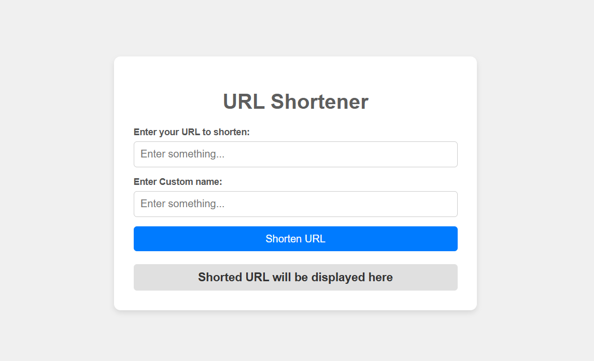
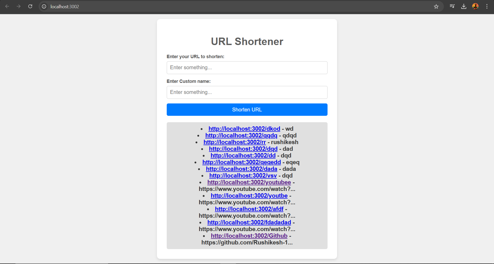

# URL Shortener Project

This project is a simple URL shortener application built with Node.js. It allows users to shorten URLs and access them via custom shortcodes.

## Features
- Shorten URLs with custom shortcodes.
- Redirect to the original URL when accessing the shortcode.
- View all shortened links in JSON format.

## Getting Started

### Prerequisites
- Node.js installed on your machine.

### Installation
1. Clone the repository or download the project files.
2. Navigate to the project directory:
   ```bash
   cd d:/Work/Node.js/Node JS projects/node-practice/urlshortener
   ```

### Running the Application
1. Install the required dependencies (if any):
   ```bash
   npm install
   ```
2. Start the server:
   ```bash
   node script.js
   ```
3. Open your browser and go to `http://localhost:3002` to access the application.

## Usage
- To shorten a URL, send a POST request to `/shorten` with a JSON body containing the `url` and `cname` (custom shortcode).
- Access the shortened URL by navigating to `http://localhost:3002/{shortcode}`.
- You can access through your specified port , here mine is 3002.

## Output Images
- Insert links to your output images here:
  - 
  - 


